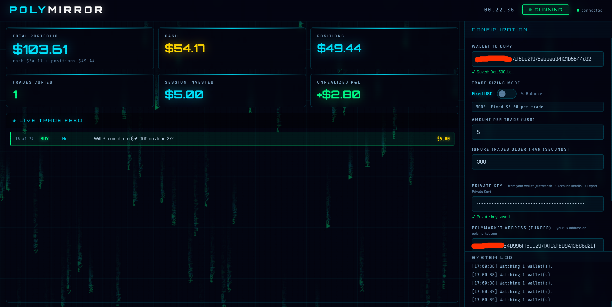

# PolyMirror — Polymarket Copy Trading Bot



Automatically copy trades from any Polymarket wallet in real time. Configure everything from the browser dashboard — no config files, no terminal commands after setup.

---

## Quick Start

### Windows

1. Install **Python 3.14+** from [python.org](https://www.python.org/downloads/) — check **"Add Python to PATH"** during install
2. Download or clone this repository
3. Open a terminal in the folder and run:
   ```
   python install.py
   ```
4. Double-click **`start.bat`** to launch the bot
5. Open your browser at **http://localhost:8080**

### Linux / VPS

```bash
git clone https://github.com/vikogozon/polymirror-copy-bot.git
cd polymirror-copy-bot
python3 install.py
bash start.sh
```

Open your browser at **http://localhost:8080**

### Mac

```bash
git clone https://github.com/vikogozon/polymirror-copy-bot.git
cd polymirror-copy-bot
python3 install.py
bash start.sh
```

Open your browser at **http://localhost:8080**

---

## First Time Setup

1. **Activate your license** — paste your license key and click ACTIVATE
2. **Enter your Polymarket credentials** — private key, API key, and the wallet address you want to copy
3. **Set your trade size** — fixed USDC amount per trade or percentage of capital
4. **Click START** — the bot begins copying trades in real time

Everything is configured directly from the dashboard. No need to edit any files.

---

## Updating

To get the latest version:

```bash
cd polymirror-copy-bot
git pull
python3 install.py
```

Then restart the bot normally (`start.bat` or `bash start.sh`). Your credentials and settings are preserved.

---

## Run in the Background

### Linux / VPS — recommended: pm2

pm2 keeps the bot running 24/7, auto-restarts if it crashes, and survives terminal disconnects.

**Install pm2:**
```bash
sudo apt-get install -y nodejs npm
npm install -g pm2
```

**Start the bot:**
```bash
cd ~/polymirror-copy-bot
pm2 start venv/bin/python --name polymirror -- run_dashboard.py
```

**Auto-start on VPS reboot:**
```bash
pm2 save
pm2 startup
```
Copy and run the command it shows (starts with `sudo env PATH=...`)

**Useful pm2 commands:**
```bash
pm2 status              # check if running
pm2 logs polymirror     # view live logs
pm2 restart polymirror  # restart the bot
pm2 stop polymirror     # stop the bot
```

---

### Windows — keep running after closing the window

**Option 1 — minimize the window:**
Double-click `start.bat`. Minimize the window. The bot keeps running.

**Option 2 — auto-start with Windows:**
Press `Win+R`, type `shell:startup`, press Enter. Create a shortcut to `start.bat` in that folder. The bot starts automatically when Windows boots.

---

## Requirements

- Python 3.14 or higher
- A funded Polymarket account (wallet-based, not email sign-up)
- A valid PolyMirror license key

---

> Trading on prediction markets involves risk of loss. Always test with small amounts first.
